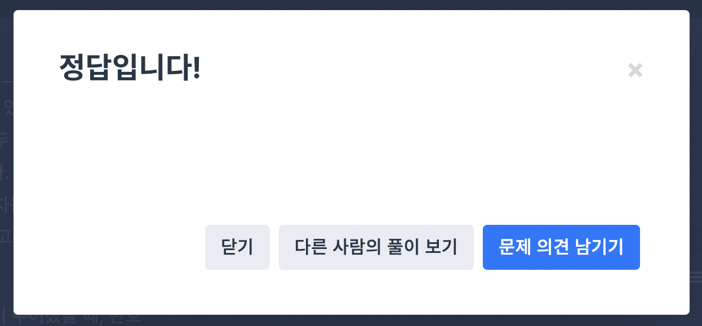

## ⌛️ 인사고과

- level : 3
- 언어 : javascript

<br/>

### 🎛 문제설명 (제한사항 및 입출력 예시 생략)

- 완호네 회사는 연말마다 1년 간의 인사고과에 따라 인센티브를 지급합니다. 각 사원마다 근무 태도 점수와 동료 평가 점수가 기록되어 있는데 만약 어떤 사원이 다른 임의의 사원보다 두 점수가 모두 낮은 경우가 한 번이라도 있다면 그 사원은 인센티브를 받지 못합니다. 그렇지 않은 사원들에 대해서는 두 점수의 합이 높은 순으로 석차를 내어 석차에 따라 인센티브가 차등 지급됩니다. 이때, 두 점수의 합이 동일한 사원들은 동석차이며, 동석차의 수만큼 다음 석차는 건너 뜁니다. 예를 들어 점수의 합이 가장 큰 사원이 2명이라면 1등이 2명이고 2등 없이 다음 석차는 3등부터입니다.

각 사원의 근무 태도 점수와 동료 평가 점수 목록 scores이 주어졌을 때, 완호의 석차를 return 하도록 solution 함수를 완성해주세요.

<br/>

## 🪜 풀이 과정

- 완호 점수를 myScore 변수에 고정으로 담고, 나머지 인원들의 각 점수를 비교하여 result 값을 ++ 해주어 완호의 등수를 result로 반환하는 방향을 생각했다.
- 동석차는 건너뛰는 조건이기 때문에 위와 같은 방향으로 적용했을때 정확한 등수가 나올 것으로 예상했다.
- 1차 제출.

```js
function solution(scores) {
  let result = 1;
  const myScore = scores[0][0] + scores[0][1];
  scores.forEach((item) => {
    if (myScore < item[0] + item[1]) result++;
  });
  return result;
}
```

- 코드실행 시 성공하였으나, 실제 제출 채점 시 정확성이 44.0 이 나온다.
- '완호가 인센티브를 받지 못하는 경우 -1을 return 합니다.' 라는 조건을 충족하지 못한 케이스로 해석되었는데, 인센티브를 받지 못하는 조건에 대해 의미가 모호하다고 생각되어 문제를 다시 읽어 보았다.
- '어떤 사원이 다른 임의의 사원보다 두 점수가 모두 낮은 경우가 한 번이라도 있다면 그 사원은 인센티브를 받지 못합니다.'
- 완호의 태도와 평가 점수를 타 인원 한명한명 점수와 비교하여 둘다 낮은 경우 -1을 return 해야 한다는 조건으로 이해했다.
- 2차 제출.

```js
function solution(scores) {
  let result = 1;
  const myScore = scores[0][0] + scores[0][1];
  scores.forEach((item) => {
    if (scores[0][0] < item[0] && scores[0][1] < item[1]) result = -1;
    if (result !== -1 && myScore < item[0] + item[1]) result++;
  });
  return result;
}
```

- 정확성이 72.0까지 올라갔다.
- 어떤 케이스를 놓친건가 다시 문제를 읽고 생각해 보았다.
- 임의 점수 그룹이 [[1, 99], [20, 20], [2, 100]] 인 경우, 0번째 아이템은 탈락이고, 비교 대상이 아닌 상태에서 1번째 아이템은 0번째 아이템과 비교했을때 작으므로 내가 만든 로직에선 예외 케이스가 발생될 수 있다고 인지했다.
- 탈락 케이스를 먼저 거르고, 필터된 배열에서 체크를 하는 방향으로 개선해야겠다고 생각하여 추가 수정을 해봤다.
- 3차 제출..

```js
function solution(scores) {
  let result = 1;
  let filterCheck = true;
  const myScore = scores[0][0] + scores[0][1];
  scores.forEach((item) => {
    if (scores[0][0] < item[0] && scores[0][1] < item[1]) result = -1;
  });
  if (result !== -1) {
    [...scores]
      .filter((item) => {
        filterCheck = true;
        scores.forEach((subItem) => {
          if (item[0] < subItem[0] && item[1] < subItem[1]) filterCheck = false;
        });
        return filterCheck;
      })
      .forEach((item) => {
        if (myScore < item[0] + item[1]) result++;
      });
  }
  return result;
}
```

- 오.. 정확도가 84.0으로 올랐다.
- 실패 결과는 모두 시간초과로 조건문을 수정해 보았다.

```js
function solution(scores) {
  let result = 1;
  let filterCheck = true;
  let failCheck = false;
  const myScore = scores[0];
  [...scores]
    .splice(1)
    .filter((item) => {
      filterCheck = true;
      scores.forEach((subItem) => {
        if (item[0] < subItem[0] && item[1] < subItem[1]) filterCheck = false;
      });
      return filterCheck;
    })
    .forEach((item) => {
      if (myScore[0] < item[0] && myScore[1] < item[1]) failCheck = true;
      if (!failCheck && myScore[0] + myScore[1] < item[0] + item[1]) result++;
    });
  return failCheck ? -1 : result;
}
```

- 음.. 시간초과 실패건이 1건 더 늘었다.
- 어떤 케이스에서 발생되는 시간초과인지 확인이 어려웠다. 다른 사람들의 풀이를 확인해 보자.
- 다른사람들의 풀이를 확인해보니, 먼저 scores 배열을 내림차순으로 정리하고, 순서대로 비교하면서, 반복문을 탈출하는 방향으로 적용했구나 생각이 들면서, 시간초과가 발생되는 지점에 대해 예상할 수 있었다.
- scores 그룹을 먼저 오름차순으로 정렬하였고, for문으로 조건 만족 시 반복문을 탈출하는 방향으로 개선해보았다.

```js
function solution(scores) {
  let result = 1;
  let checkItem = true;
  const myScore = scores[0];
  // 근태점수 기준 오름차순 정렬, 동점이라면 동료평가점수 기준.
  let scoreGroups = [...scores].sort((a, b) => (a[0] === b[0] ? a[1] - b[1] : b[0] - a[0]));

  for (let scoreItem of scoreGroups) {
    if (myScore[0] < scoreItem[0] && myScore[1] < scoreItem[1]) {
      return -1;
    } else if (myScore[0] + myScore[1] < scoreItem[0] + scoreItem[1]) {
      checkItem = true;
      for (let score of scores) {
        if (score[0] > scoreItem[0] && score[1] > scoreItem[1]) {
          checkItem = false;
          break;
        }
      }
      if (checkItem) result++;
    }
  }
  return result;
}
```

- 오.. 정확도가 96.0까지 올라왔다.
- 조금 더 개선해보자.

```js
function solution(scores) {
  let result = 1;
  const myScore = scores[0];
  const scoreCheck = (score1, score2) => {
    for (let score of scores) {
      if (score[0] > score1 && score[1] > score2) return false;
    }
    return true;
  };

  for (let score of scores) {
    if (myScore[0] < score[0] && myScore[1] < score[1]) {
      return -1;
    } else if (myScore[0] + myScore[1] < score[0] + score[1]) {
      if (scoreCheck(score[0], score[1])) result++;
    }
  }
  return result;
}
```

- 소스를 리펙토링 하다보니, 굳이 오름차순 정렬을 사용하지 않고도 괜찮은 로직이 떠올랐고, 좀더 개선해 보았다.
- 인센티브를 받지 못하는 조건을 체크, 인센티브를 받는다면 나보다 더 높은 점수의 멤버를 앞으로 해서 result 값을 ++ 시켜 등수를 체크하는 방향을 생각했다.
- 지난 시간초과의 결과를 받았던 로직에 대해서는 함수 내 반복문 로직이 비효율적이였던 것으로 파악했고, 이를 개선하여 아래와 같이 제출했다.
- 
- 성공!
